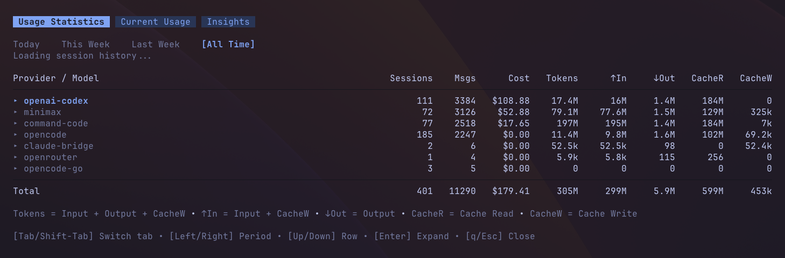
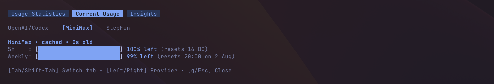
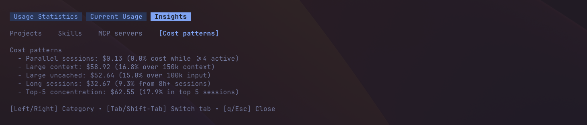

# @pi-vault/pi-usage

[](https://www.npmjs.com/package/@pi-vault/pi-usage)
[](https://github.com/pi-vault/pi-usage/actions/workflows/quality.yml)
[](https://nodejs.org/)
[](LICENSE)

`@pi-vault/pi-usage` tracks Pi usage across local sessions and supported live providers in one dashboard. Use it to review costs, tokens, session activity, current quotas, balances, and usage insights without leaving Pi.

## Install

Install the extension with Pi:

```bash
pi install npm:@pi-vault/pi-usage
```

Reload Pi after installation or an update:

```text
/reload
```

## Use it

Open the dashboard with cached data when available:

```text
/usage
```

Force live-provider refresh, rescan local session history, and open the dashboard:

```text
/usage:refresh
```

Use `/usage` for a quick inspection and `/usage:refresh` when you need current provider data or a fresh offline-history scan.

## Dashboard

The dashboard is a tabbed overlay. Press `Tab` or `Shift-Tab` to move between its three views.

### Usage Statistics



Aggregates local Pi session history for the selected period:

- `Today`, `This Week`, `Last Week`, or `All Time`.
- Provider/model rows that can be expanded and collapsed.
- Totals for sessions, messages, cost, total tokens, input, output, cache reads, and cache writes.

### Current Usage



Shows the selected live provider's quota and balance information. Provider data can be `live`, `cached`, `stale`, `local`, or `unavailable`, depending on credentials, refresh state, and provider support.

- Select `OpenAI/Codex`, `MiniMax`, `StepFun`, `OpenCode Go`, `Command Code`, or `OpenRouter`.
- View rolling quota windows such as `5h` and weekly limits.
- View balance-style fields when a provider exposes them.
- View StepFun's monthly `Credits` usage when its browser session is configured.

### Insights



Shows all-time breakdowns from local Pi session history. Press Left or Right to switch between populated categories:

- `Projects`
- `Skills`
- `MCP servers`
- `Cost patterns`

Only categories with data appear. Each category keeps a capped list of rows and shows an overflow summary when more data exists.

## Keyboard shortcuts

Global:

- `[Tab]` — next tab.
- `[Shift-Tab]` — previous tab.
- `[q]` / `[Esc]` — close the dashboard.

Usage Statistics:

- `[Left/Right]` — switch period.
- `[Up/Down]` — move through rows.
- `[Enter]` / `[Space]` — expand or collapse the selected provider row.

Current Usage:

- `[Left/Right]` — switch provider.

Insights:

- `[Left/Right]` — switch category.

The dashboard footer shows shortcuts for the active tab.

## Configuration

### `usage.json`

Create `$PI_CODING_AGENT_DIR/extensions/usage.json` to disable live providers that you do not want queried.

Default behavior:

- Missing file: all providers stay enabled.
- `{}`: all providers stay enabled.
- Omitted provider: that provider stays enabled.
- Malformed JSON: Pi Usage ignores it and uses the default behavior.

Default example:

```json
{}
```

Explicit all-providers-enabled example:

```json
{
  "providers": {
    "openai-codex": { "enabled": true },
    "minimax": { "enabled": true },
    "stepfun": { "enabled": true },
    "opencode-go": { "enabled": true },
    "command-code": { "enabled": true },
    "openrouter": { "enabled": true }
  }
}
```

Disable MiniMax only:

```json
{
  "providers": {
    "minimax": { "enabled": false }
  }
}
```

### Provider setup

Offline history works without provider credentials. All supported live providers appear unless disabled in `usage.json`. Providers without valid credentials may show `unavailable` or a local fallback state.

#### OpenAI/Codex

Pi Usage can reuse existing Pi or Codex authentication. Optional overrides:

- `OPENAI_CODEX_OAUTH_TOKEN`
- `OPENAI_CODEX_ACCESS_TOKEN`
- `CODEX_OAUTH_TOKEN`
- `CODEX_ACCESS_TOKEN`
- `OPENAI_CODEX_ACCOUNT_ID`
- `CHATGPT_ACCOUNT_ID`

#### MiniMax

Set one of:

- `MINIMAX_CODING_API_KEY`
- `MINIMAX_API_KEY`

Optional override:

- `MINIMAX_API_HOST`

#### StepFun

Pi Usage reads Step Plan monthly Credits from your logged-in StepFun Platform browser session.

1. Sign in at [platform.stepfun.ai](https://platform.stepfun.ai/).
2. Open browser DevTools → **Application** → **Storage** → **Cookies** → `https://platform.stepfun.ai`.
3. Copy the `Oasis-Token` and `Oasis-Webid` cookie values.
4. Export them before starting Pi:

   ```sh
   export STEPFUN_TOKEN='your-oasis-token'
   export STEPFUN_WEB_ID='your-oasis-web-id'
   ```

Both values are secrets. Do not commit or share them. When the browser session expires, copy and export fresh cookie values.

#### OpenCode Go

Set:

- `OPENCODE_GO_COOKIE_HEADER`
- `OPENCODE_GO_WORKSPACE_ID`

`OPENCODE_GO_WORKSPACE_ID` accepts either the raw `wrk_...` ID or the full workspace URL.

#### Command Code

Set:

- `COMMAND_CODE_COOKIE_HEADER`

#### OpenRouter

Set:

- `OPENROUTER_API_KEY`

Optional overrides:

- `OPENROUTER_API_URL`
- `OPENROUTER_X_TITLE`
- `OPENROUTER_HTTP_REFERER`

## Changelog

See [`CHANGELOG.md`](CHANGELOG.md) for release-by-release notes.

## License

MIT — see [`LICENSE`](LICENSE).
