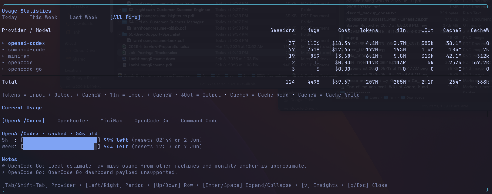

# @pi-vault/pi-usage

[](https://www.npmjs.com/package/@pi-vault/pi-usage)
[](https://github.com/pi-vault/pi-usage/actions/workflows/quality.yml)
[](https://nodejs.org/)
[](LICENSE)

Show aggregated Pi usage stats across your sessions — token and cost breakdowns by provider and model, plus live quota snapshots for configured providers, all from a single in-app dashboard.



## Install

```bash
pi install npm:@pi-vault/pi-usage
```

Then reload Pi:

```bash
/reload
```

## Commands

- `/usage` — open the usage dashboard without forcing a live refresh. Use this for fast, side-effect-light inspection.
- `/usage:refresh` — force live provider refresh, rescan local history, then open the usage dashboard. Use this when you want the latest usage data (requires providers already configured in Pi).

## Dashboard

The dashboard opens in a TUI overlay over the current Pi session and is split into three bordered sections plus a footer of keyboard hints.

### Usage statistics

The top section is an aggregated table of all token and cost usage across your local Pi sessions.

- **Period switching** — `Today` / `This Week` / `Last Week` / `All Time` is selectable with the arrow keys.
- **Provider rows** — one row per provider found in your local Pi history, sorted by cost. Rows are expandable to show per-model rows.
- **Per-row columns** — sessions, messages, cost, total tokens, input, output, cache reads, and cache writes.
- **Total row** — a summary line at the bottom that aggregates every visible column for the active period.

### Current usage

A live view focused on rolling-window quota bars and balances for whichever providers are already configured in Pi.

- **Provider tabs** — switch between configured providers (`OpenAI/Codex`, `MiniMax`, `StepFun`, `OpenCode Go`, `Command Code`, `OpenRouter`) with `Tab` / `Shift-Tab`.
- **Quota bars** — `5h` and weekly windows with the percentage remaining and a compact reset description.
- **Balances** — credits/remaining balance rows for providers that report a balance (for example, OpenRouter credits and the local Command Code fallback).
- **Live status** — each card reports whether the data is live, cached, stale, or a local-only fallback, with the cache age when relevant.
- **Live refresh cadence** — live provider snapshots are cached for 30 minutes and background refresh checks run every 30 minutes. `/usage:refresh` still forces an immediate refresh.

### Notes

Per-provider diagnostics and caveats (e.g. live status, cache age, source) are surfaced inline so the dashboard can explain why a card is empty or showing a fallback.

### Keyboard navigation

- `[Tab/Shift-Tab]` — switch between providers in the current usage tabs.
- `[Left/Right]` — change the selected period in the usage table.
- `[Up/Down]` — move through table rows.
- `[Enter/Space]` — expand or collapse provider rows.
- `[v]` — toggle the insights view.
- `[q/Esc]` — close the dashboard.

## Setup

Offline totals always work from local Pi history. Live provider cards are shown only for providers you have already configured in Pi.

### StepFun setup

Set one of:

- `STEPFUN_TOKEN`
- `STEPFUN_USERNAME` and `STEPFUN_PASSWORD`

## Event API

`@pi-vault/pi-usage` emits:

- `usage-core:ready`
- `usage-core:update-current`

Both events send `{ state }` where `state` is a cloned `UsageCoreState` snapshot.

For late subscribers, request the current snapshot via `usage-core:request`:

```ts
import {
  USAGE_CORE_REQUEST_EVENT,
  type UsageCorePayload,
} from "@pi-vault/pi-usage/events";

pi.events.emit(USAGE_CORE_REQUEST_EVENT, {
  type: "current",
  reply: ({ state }: UsageCorePayload) => {
    // Render from latest cloned snapshot.
  },
});
```

## Acknowledgements

This package borrows ideas from these projects for Pi UX and provider usage fetching approaches:

- [tmustier/pi-extensions](https://github.com/tmustier/pi-extensions)
- [marckrenn/pi-sub](https://github.com/marckrenn/pi-sub)
- [steipete/CodexBar](https://github.com/steipete/CodexBar)

## Development Setup

```bash
pnpm install
pnpm test
pnpm check
pnpm pack --dry-run
```

## License

MIT
